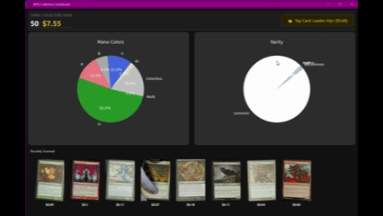

# MTG Live Scanner

A real-time computer vision pipeline for cataloging Magic: The Gathering collections. It uses a custom YOLOv8 model to detect cards on a desk, tracks them in real-time, reads their titles using enhanced OCR, identifies them via the Scryfall API, and builds a local visual database of your collection.

## Features

### Live Vision Pipeline
*   **Custom Detection:** Trained YOLOv8 model specifically for MTG cards (ignores playmats, hands, and debris).
*   **Smart Tracking:** Assigns unique IDs to cards as they move. Only triggers a scan when the card stabilizes.
*   **Visual Feedback:** Real-time augmented reality overlay showing pricing tiers (Grey/White/Blue/Gold/Orange) and read confidence.

### Intelligent Scanning
*   **Perspective Warping:** Automatically detects card corners and aspect ratio (Portrait vs Landscape) to flatten skewed cards into perfect rectangles.
*   **Enhanced OCR:** Uses EasyOCR with a custom preprocessing pipeline (CLAHE + 2x Upscaling) to read difficult text (e.g., white text on blue backgrounds).
*   **Orientation Consensus:** Automatically determines if a card is upside-down or sideways by scoring text legibility across 4 rotations.

<p align='center'>
  
</p>

### The Librarian (Database)
*   **Fluid Identity:** A card entry refines in real-time. It might start as "Scanning...", resolve to "Wool Demon" (low confidence), and correct itself to "Nyxborn Wolf" (high confidence) without creating duplicates.
*   **Deep Archival:** Stores high-res local scans, official Scryfall art, Flavor Text, Release Dates, and Artist credits.
*   **Smart Caching:** Minimizes API usage by remembering past corrections and invalid inputs.

### Collection Dashboard
*   **Analytics:** Interactive charts for Color Balance and Rarity Distribution.
*   **Leaderboard:** Track total collection value and highlight your most expensive cards.
*   **Visual Gallery:** Browse your scans side-by-side with official artwork.
<p align='center'>
  
</p>

---

## 🛠️ Setup & Usage

1.  **Install Dependencies**
    *Requires Python 3.10+ and a CUDA-capable GPU for optimal performance.*
    ```bash
    pip install -r requirements.txt
    ```

2.  **Run the Application**
    ```bash
    python main.py
    ```
    *   **Scanner Mode:** Opens first. Place cards under the camera.
    *   **Dashboard Mode:** Opens automatically when you close the scanner.

3.  **Command Line Flags**
    *   `python main.py --scanner-only`: Run only the capture loop.
    *   `python main.py --report`: Skip capture, open the Dashboard immediately.

---

## ⚙️ Configuration (`config.py`)

You can tune almost every aspect of the system by editing `config.py`.

### Camera & Hardware
*   `CAMERA_INDEX`: 0 for default webcam, 1 for external.
*   `REQUEST_WIDTH` / `HEIGHT`: Forced resolution (Default: 3840x2160).

### Detection & Tracking
*   `CONFIDENCE_THRESHOLD`: Lower this if cards aren't detected (Default: 0.7).
*   `DETECT_EVERY_N_FRAMES`: Process detection every X frames (Lower = Smoother tracking, Higher = Better FPS).
*   `MAX_TRACKING_DISTANCE`: Increase if cards "lose" their ID when moved quickly.

### Pricing Colors
Modify the price thresholds for the UI overlay:
```python
PRICE_ALERTS = {
    "mythic":   {"min": 20.00, "color": "#ff8000"},
    "rare":     {"min": 5.00,  "color": "#d4af37"},
    ...
}
```

---

## 🏗️ Architecture & Changelog

### Phase 9-10: Polish & Analytics (Final Release)
*   **Deep Lore Update:** Database schema expanded to include `flavor_text`, `released_at`, and `artist`.
*   **Pro Dashboard:** Redesigned Detail View with side-by-side image comparison, Rarity Distribution Chart, and "Top Card" Leaderboard.
*   **Scanner UI:** Centered, responsive layout with Rarity-style pricing colors.

### Phase 8: OCR Refinement
*   **Enhancement Pipeline:** Implemented Contrast Limited Adaptive Histogram Equalization (CLAHE) and 2x Upscaling to solve "White Text on Blue Background" issues.
*   **Logic:** Reverted to EasyOCR (GPU) after determining Tesseract/Paddle introduced unnecessary complexity/latency for this specific use case.

### Phase 7: Grand Unification
*   **Pipeline Integration:** Connected Video Thread, Tracker, Librarian, and GUI into a single reactive loop.
*   **Fluid Updates:** Database now supports `UPSERT` logic, allowing a card's identity to refine over time without creating duplicate entries.
*   **Visual Widgets:** Added `ActiveCardWidget` to the live feed.
*   **Quality Gates:** Implemented logic to only save a new scan if it has a higher confidence score than the previous best for that object ID.

### Phase 6: Librarian & API
*   **Database:** Implemented SQLite schema separating `catalog` (Scryfall cache) from `collection` (User scans).
*   **API:** Strict 1.0s rate limiting and Fuzzy Matching.
*   **Controller:** Background thread processing the identification queue.

### Phase 5: Image Processing & OCR
*   **Smart Warping:** Automatically detects card corners and aspect ratio (Portrait vs Landscape).
*   **Smart OCR:** Uses EasyOCR (GPU-accelerated) to read card titles.
*   **Orientation Logic:** Automatically checks 4 orientations (Upright, Inverted, 90° CW, 90° CCW).

### Phase 3-4: Tracking & Detection
*   **Custom Model:** Trained YOLOv8 model on specific MTG card data.
*   **Centroid Tracking:** Implemented persistent object IDs and history trails.

### Phase 1-2: Video Object Detection
*   **Video:** Implemented `VideoThread` in `core/video.py` for asynchronous 4K capture.
*   **Object Detection:** Restricted YOLOv8 detection w/ debug visualization

### GPU Setup Potential Issue (Error Encountered)
If you see `NotImplementedError: torchvision::nms`, it means your PyTorch and Torchvision versions are mismatched (one is CPU, one is GPU).

To fix this, force a reinstall of the CUDA-enabled versions:
```bash
pip install torch torchvision --index-url https://download.pytorch.org/whl/cu130 --force-reinstall 
```


